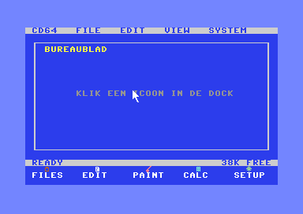
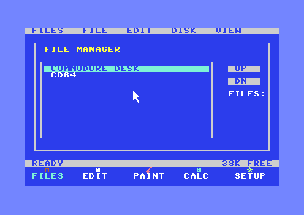
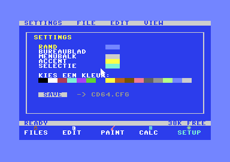
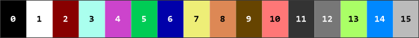

# Commodore Desk 64

A graphical, Apple-style desktop GUI for the Commodore 64, written in 6502/6510
assembly (Kick Assembler). A Windows-95-style menu bar at the top, one large
window in the middle and a status bar with date and time at the bottom — no
draggable windows. Boots as a **D71 disk** and as an
**EasyFlash `.CRT` cartridge** (instant boot).




<sub>Running in VICE: the desktop with contextual menu bar, status bar and the dock.</sub>

### Screens

| File Manager | Settings | Paint |
|---|---|---|
|  |  |  |

<sub>Paint: full-screen multicolor bitmap with a 4-color palette (erase / white / red / cyan).</sub>

---

## Features

- **Desktop shell**: a fixed menu bar (`CD64 · DESKTOP · FILES · INET · SETUP`),
  one large window (rows 1-23) and a **status bar** with date and time.
- **Windows-95-style boot screen**: a separate loader (`BOOT`) shows a sharp
  **hi-res bitmap** splash, then chain-loads the desktop — so the splash costs
  **no memory** in the running OS (it's overwritten when `CD64` loads).
- **One pointer, three input sources**: 1351 **mouse** (port 1), **joystick**
  (port 2) and the **keyboard** (cursor keys) all move the same sprite cursor.
- **Apps**:
  - **Files** — File Manager: reads the disk directory into a scrollable list.
  - **Editor** — text editor: type, RETURN (new line), DEL (backspace).
  - **Paint** — real **multicolor bitmap** paint (160×200): full-screen canvas,
    white background, all **16 colors** (per-cell colour slots) + an **eraser**
    button, starts on black; hold fire to drag-draw, **ESC** to exit.
  - **Calc** — 16-bit calculator (+ − × ÷).
  - **Settings** — all **theme colors are adjustable**, plus a **font** picker
    (System / Classic / Bold); everything is saved to `CD64.CFG`.
- **F1 context help** — a help panel whose text depends on the active app; press
  space to close it.
- **Drop-down menus** — `CD64` (HELP · RESET · EXIT · ABOUT) and `DESKTOP`
  (ADD / EDIT / DELETE PROGRAM); click an item or click away to close.
- **INET** — network driver test: detects an RR-Net (CS8900) or an Ultimate
  (UCI) and shows the network configuration. See *Networking in VICE* below.
- **Widgets**: buttons, checkbox, scrollable list, modal dialog.
- **SID click sound**.
- Strictly the **16-color VIC-II palette**.

## Color palette

Only the 16 VIC-II colors — no approximations.



| # | Name | Hex | | # | Name | Hex |
|---|---|---|---|---|---|---|
| 0 | Black | `#000000` | | 8 | Orange | `#DD8855` |
| 1 | White | `#FFFFFF` | | 9 | Brown | `#664400` |
| 2 | Red | `#880000` | | 10 | Light red | `#FF7777` |
| 3 | Cyan | `#AAFFEE` | | 11 | Dark grey | `#333333` |
| 4 | Purple | `#CC44CC` | | 12 | Grey | `#777777` |
| 5 | Green | `#00CC55` | | 13 | Light green | `#AAFF66` |
| 6 | Blue | `#0000AA` | | 14 | Light blue | `#0088FF` |
| 7 | Yellow | `#EEEE77` | | 15 | Light grey | `#BBBBBB` |

The colors and theme roles are constants in
[`include/palette.inc`](include/palette.inc); in **Settings** you map each theme
role to one of these 16.

## Controls

| Action | Mouse | Joystick (port 2) | Keyboard |
|---|---|---|---|
| Move cursor | move the mouse | push the stick | cursor keys (+ shift for left/up) |
| Click | left button | fire | **space** or **return** |
| Type (Editor) | — | — | letters/digits, RETURN, DEL |
| Context help | — | — | **F1** (space closes it) |
| Back to desktop (close app) | — | — | **ESC** (= RUN/STOP) |

Click **CD64** or **DESKTOP** in the menu bar to open its drop-down; **FILES**,
**INET** and **SETUP** open the app directly. Click the **clock** in the status bar
to open SETUP, where the `CLOCK:` line sets the date and time. **ESC** closes the active app and
returns to the desktop — that's how you leave the text editor (where space types a
space) and Paint. (In VICE on a PC the RUN/STOP key is mapped to **Esc**.)

## Building

Requires (paths are set in the `.bat` scripts — adjust as needed): **Java**,
**Kick Assembler** (`KickAss.jar`), **VICE** (`x64sc`, `c1541`, `cartconv`).

**One-time — extract the charset.** The System charset (`data/chargen.bin`) is the
C64 character ROM and is **not** in this repo (copyright). Extract it locally from
your VICE installation:
```bash
mkdir -p data
head -c 2048 "<VICE>/C64/chargen-901225-01.bin" > data/chargen.bin
```
(The first 2 KB = the uppercase/graphics set.)

**One-time — generate the extra font data.** The Lowercase and Tiny fonts need
`data/lower.bin` (the C64 lowercase letters, from the ROM) and `data/tiny.bin`
(a generated 3×5 micro-font). Adjust the ROM path at the top of the script, then:
```bash
python tools/make_fonts.py
python tools/make_fremenfont.py    # -> data/fremen.bin, serif.bin, mono.bin, casual.bin, heavy.bin
```

**Disk (D71):**
```bat
build_disk.bat        :: -> build\CD64.d71
```
```bash
x64sc -autostart build/CD64.d71
```

**Cartridge (EasyFlash .CRT):**
```bat
build_cart.bat        :: -> build\CommodoreDesk64.crt
```
```bash
x64sc -cartcrt build/CommodoreDesk64.crt -8 build/CD64.d71
```
Flashing to real hardware: copy the `.CRT` to an SD card and flash it with
**EasyProg** on the C64.

> The D71 version loads over the slow IEC bus (~½ minute on real hardware). The
> cartridge version boots **instantly**: the reset stub copies the OS image from
> ROM into RAM (`$0801`), switches the cartridge off and runs as a plain C64.

## Networking in VICE (INET)

INET talks to an **RR-Net** ethernet cartridge (CS8900a chip at `$DE00`). VICE
emulates this cartridge and connects it to a real network adapter on your PC via
**Npcap**. Without Npcap, VICE prints `LoadLibrary WPCAP.DLL failed!` and the
cartridge does nothing.

**1. Install Npcap (one-time, Windows).**
Download it from <https://npcap.com> and run the installer as administrator.
In the installer, tick **"Install Npcap in WinPcap API-compatible Mode"** — VICE
looks for `wpcap.dll`, which only exists in that mode (it ends up in
`C:\Windows\System32\Npcap\`). Restart VICE afterwards.

Check that your VICE build supports ethernet: `x64sc -help` must list
`-ethernetcart`. (The official Windows GTK3 builds do.)

**2. VICE settings (GUI).**

| Where | Setting |
|---|---|
| *Preferences → Settings → Peripheral devices → Ethernet* | **Interface**: your **wired** network adapter (Wi-Fi often doesn't pass raw ethernet frames) |
| *Settings → Cartridges → Ethernet Cartridge* | **Enable Ethernet Cartridge**: on · **Mode**: RR-Net · **Base address**: `$DE00` |
| *Settings → Cartridges → GeoRAM* | **off** — GeoRAM also sits at `$DE00` and hides the RR-Net |
| *Settings → Cartridges → REU* | off (not needed; frees `$DF00`) |
| *Peripheral devices → Drive 8* | **1541** for `CD64.d64`, **1571** for `CD64.d71` (a 1581 cannot read these images) |

**3. Command line (same settings, nothing saved to your VICE config):**
```bash
x64sc -drive8type 1541 +georam +reu -ethernetcart -ethernetcartmode 1 -ethernetcartbase 0xDE00 -autostart build/CD64.d64
```
To pick a specific network adapter, add `-ethernetioif "<name>"`. On Windows the
name has the form `\Device\NPF_{GUID}`; list the GUIDs with PowerShell:
```powershell
Get-NetAdapter | Select-Object Name, InterfaceDescription, InterfaceGuid
```
Example (replace the GUID with your own):
```bash
x64sc -drive8type 1541 +georam +reu -ethernetcart -ethernetcartmode 1 -ethernetcartbase 0xDE00 -ethernetioif "\Device\NPF_{12345678-90AB-CDEF-1234-567890ABCDEF}" -autostart build/CD64.d64
```

**4. Test.** Click **INET** in the menu bar. Expected:
```text
C64 NETWORK DRIVER TEST
PLATFORM : RR-NET
BASE     : $DE00
CS8900   : FOUND
ID       : $630E REV $09
STATUS   : READY
```
`NOT FOUND` means the cartridge is off, in TFE mode, at another base address,
or blocked by GeoRAM; click **RESCAN** after changing a setting. The
**cartridge build** (EasyFlash) never scans, because EasyFlash itself uses
`$DE00`/`$DF00` — it shows `IN USE BY CARTRIDGE`. The **Ultimate** (UCI)
detection is not emulated by VICE; it can only be tested on an Ultimate 64 /
1541 Ultimate-II+ with the Command Interface enabled. Details and the test
procedure: [`docs/INET_Milestone1.md`](docs/INET_Milestone1.md).

## Architecture

```
apps/     Files · Editor · Paint · Calc · Settings · INET
gui/      shell (desktop/menu bar/status bar) · widgets · help · launcher
gfx/      gfx primitives · font · sprite (cursor)
kernel/   kernel · events · irq (raster 50 Hz) · clock (CIA TOD) · memory · banking
net/      network drivers: CS8900/RR-Net · Ultimate UCI · platform detection
hal/      vic · input (mouse/joy/kbd) · disk (IEC) · sound (SID)
include/  palette · layout · memmap · abi · hardware
```

- **App overlays**: the resident **core** (kernel, gfx, input, shell/desktop) lives
  at `$0801`; each app (Files, Editor, Paint, Calc, Settings) is a **separate PRG**
  loaded from disk into a shared overlay region at `$8000` when you open it
  (`LOADING …`). Only one app is resident at a time, so the memory ceiling is gone
  and the OS scales to many apps. The cartridge boots the core and loads the same
  app PRGs from the attached disk.
- **Display**: hi-res character mode (40×25) for the desktop; Paint switches to
  multicolor bitmap in VIC bank 1 (`$4000-$7FFF`, free RAM above the OS) and back.
  The cursor is hardware sprite 0.
- **System clock**: a raster IRQ (50 Hz) polls input and generates events.
- **Memory**: runs from RAM with BASIC/KERNAL banked out; KERNAL is banked back in
  temporarily for disk I/O.
- **Font**: the System charset is embedded (`data/chargen.bin`) at `$3800`.

## Settings (persistence)

In **Settings** you pick a base **color profile** (Commodore 64 / Matrix /
Paper), a color per theme role (border, desktop, menu bar, accent, selection),
the **drop-down style** (filled/clear) and a **font**. There are 10 fonts: five
built in (System, Classic, Bold, Lowercase, Tiny — derived or overlaid from the
System charset) and five original **disk fonts** (Fremen, Serif, Mono, Casual,
Heavy) that load from disk into the charset RAM on selection. Click the `FONT:`
line to cycle; the whole UI switches instantly. **SAVE** writes `CD64.CFG` to the
D71 and the OS loads it back at boot. All fonts share one UI-glyph block (frames,
dock icons), so only the text glyphs change.

## Files

| File | Role |
|---|---|
| `disk_main.asm` | entry point for the D71 build (PRG at `$0801`) |
| `boot_main.asm` | Windows-95-style boot loader: shows the splash, chain-loads `CD64` |
| `main_cart.asm` | entry point for the EasyFlash CRT (OS image + reset stub) |
| `tools/make_bootscreen.py` | generates the native hi-res boot screen bitmap (`data/boot_*.bin`) |
| `tools/make_fonts.py` | extracts lowercase + generates the Tiny 3×5 font (`data/lower.bin`, `data/tiny.bin`) |
| `tools/make_fremenfont.py` | generates the five original disk fonts (Fremen, Serif, Mono, Casual, Heavy) |
| `build_disk.bat` / `build_cart.bat` | build scripts |
| `Commodore-Desk-64-Ontwikkelplan.md` | full development plan (phases 0–10, Dutch) |
| `C64_KICKASS_SKILL.md` | Kick Assembler working instructions (Dutch) |
| `c64_ka_syntax_checker.py` | static syntax check |

## Status

Phases **0–10** complete: boot (disk + cart), kernel/IRQ, gfx primitives,
input HAL, events, desktop shell, widgets, 5 apps, color personalization with
persistence, and finishing (splash, sound, cartridge, docs). Plus F1 context help,
auto-hiding bars, and apps that fill the full work area.

**Open / upgrades:** selectable dock shape; config in flash instead of on disk.
Later: a **Commodore 128** port (all hardware-specific code lives in `hal/`).

> The development plan and the Kick Assembler skill document are still in Dutch;
> the application's on-screen text and this README are English.
