# Commodore Desk 64

A graphical desktop for the **Commodore 64**, written in 6502/6510 assembly
(Kick Assembler). It has a Windows-95-style menu bar, one large window, a status
bar with date and time, and a desktop of programs you start with a click.
There are built-in programs (editor, paint, calculator, file manager) and
network programs: a **BBS terminal**, **e-mail**, an **AI chat** and **ping**,
all running on the C64 itself over its own TCP/IP stack. A **SID player**
plays the music files on the disk.

It runs from a **D81, D71 or D64 disk** or an **EasyFlash cartridge** (instant boot),
in VICE or on real hardware with an **RR-Net**, an **Ultimate 64 / 1541
Ultimate-II+** or a **WiC64** (WiFi on the userport).

| Boot screen | Desktop |
|---|---|
| 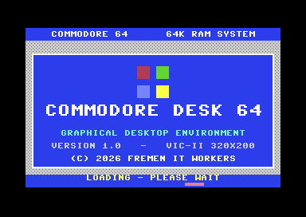 | 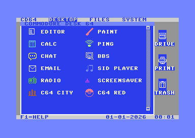 |

---

## Contents

- [Screenshots](#screenshots)
- [The desktop](#the-desktop)
- [Programs](#programs)
- [Printing](#printing)
- [Network programs](#network-programs)
- [Settings (SYSTEM menu)](#settings-system-menu)
- [Themes and fonts](#themes-and-fonts)
- [Controls](#controls)
- [Your files and settings](#your-files-and-settings)
- [Building](#building)
- [Running it in VICE with networking](#running-it-in-vice-with-networking)
- [Real hardware](#real-hardware)
- [Architecture](#architecture)
- [Files and tools](#files-and-tools)

---

## Screenshots

| Desktop menus | | |
|---|---|---|
| 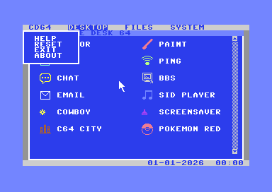 | 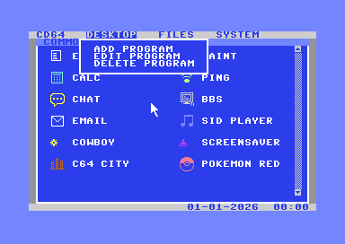 | 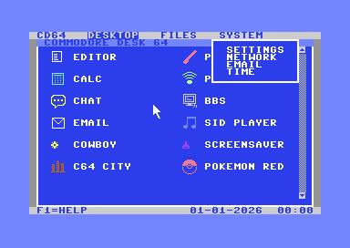 |
| **CD64**: help, reset, exit, about | **DESKTOP**: add/edit/delete programs | **SYSTEM**: all settings |

| Programs | | |
|---|---|---|
| 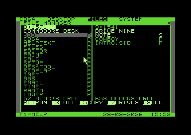 | 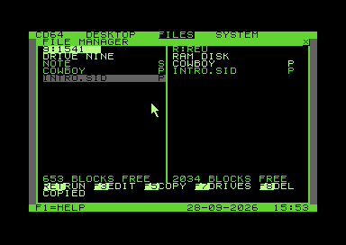 | 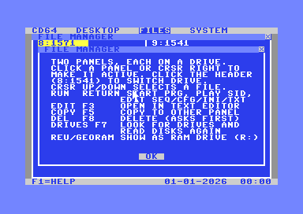 |
| File Manager: two drives side by side | Copying to the REU RAM drive | F1 in the File Manager |
| 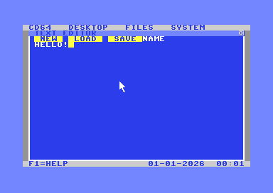 | 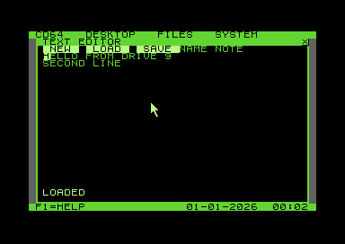 | 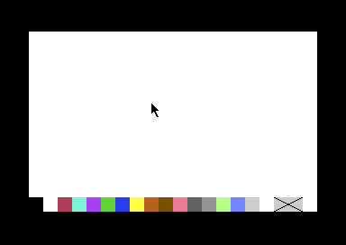 |
| Text editor | A SEQ file opened from the File Manager | Paint (multicolour bitmap) |
| 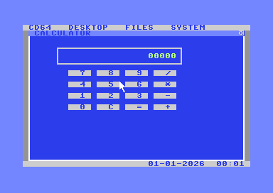 | 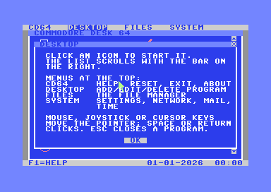 | 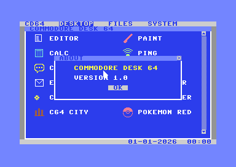 |
| Calculator | F1: context help | About |
| 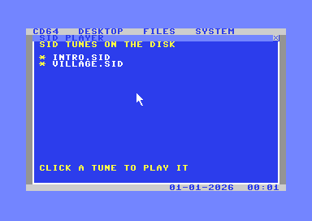 | 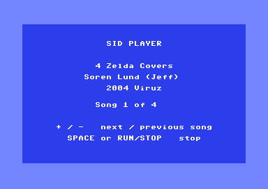 | 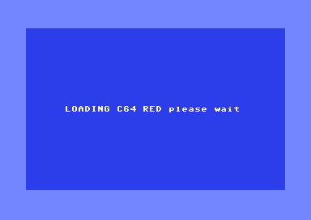 |
| SID Player: the tunes on the disk | Playing a tune | Starting a game |

| Network programs | | |
|---|---|---|
| 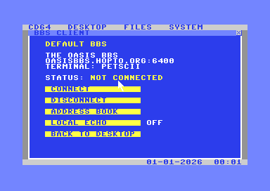 | 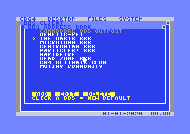 | 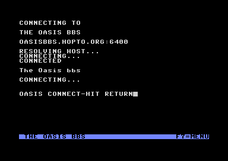 |
| BBS client | BBS address book | Connected to The Oasis BBS |
| 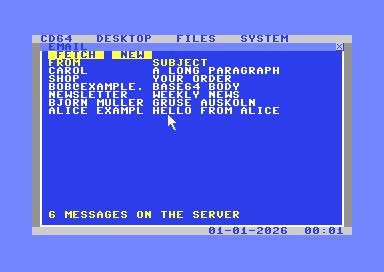 | 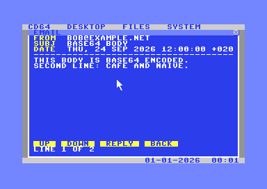 | 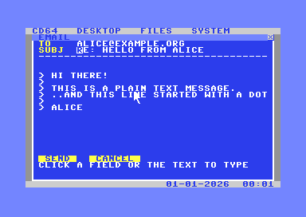 |
| E-mail: mailbox | Reading a message | Writing a reply |
| 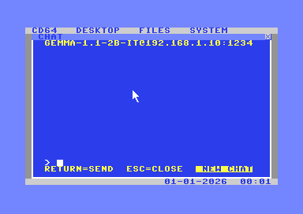 | 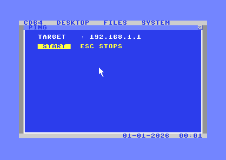 | 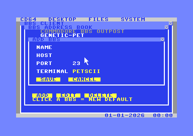 |
| AI chat | Ping | Adding your own BBS |
| 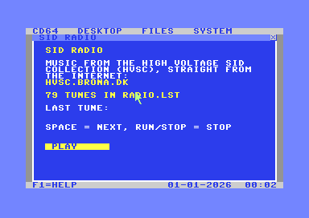 | 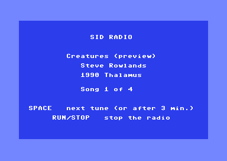 | |
| SID Radio | Playing a tune from the HVSC | |

| Settings | | |
|---|---|---|
| 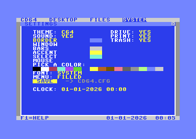 | 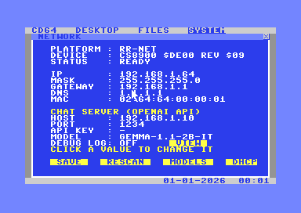 | 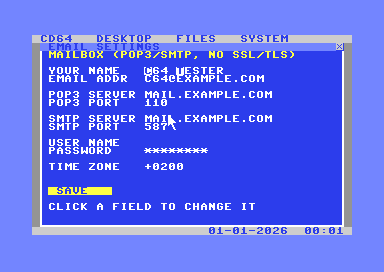 |
| SYSTEM → SETTINGS | SYSTEM → NETWORK | SYSTEM → EMAIL |
| 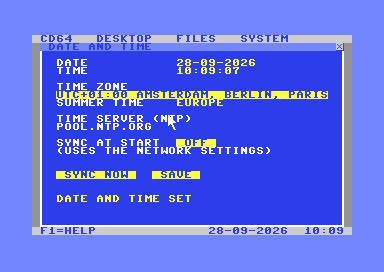 | 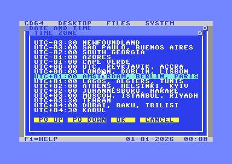 | |
| SYSTEM → TIME: date and time from the internet | Picking a time zone | |

<sub>All screenshots were made in VICE with example settings.</sub>

---

## The desktop

- **Boot screen**: while the desktop loads, a separate loader (`BOOT`) shows
  a sharp hi-res bitmap splash with the version and `LOADING - PLEASE WAIT`.
  It costs no memory in the running system, because the desktop overwrites
  it when it loads.
- **Menu bar** (top): `CD64 · DESKTOP · FILES · SYSTEM`.
  - **CD64**: HELP, RESET (reboots the C64), EXIT (back to BASIC without a
    reset) and ABOUT.
  - **DESKTOP**: ADD PROGRAM, EDIT PROGRAM and DELETE PROGRAM, to put your own
    programs on the desktop (name, icon, colour, PRG file).
    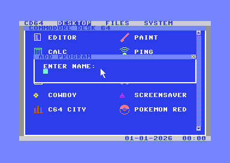
  - **FILES** opens the File Manager.
  - **SYSTEM**: SETTINGS, NETWORK, EMAIL and TIME. These are the only way to
    reach settings, the same everywhere.
- **Desktop icons**: the built-in programs (EDITOR, PAINT, CALC, PING, CHAT,
  BBS, EMAIL, SID PLAYER, RADIO) and your own programs, for example games. Click one to start it.
  The list scrolls when it gets longer than the window.
- **Starting a program from disk** (for example a game) shows a calm screen in the theme colours with
  `LOADING <name> please wait` while it loads. When the program ends (it
  returns to BASIC), or when you press RESTORE, you come back to the desktop.
- **Status bar** (bottom): date and time from the C64's own clock (CIA TOD).
  SYSTEM → TIME can set it from a time server on the internet.
- **F1** shows help for what you are doing, everywhere: on the desktop, in
  every program, and also inside menus and dialogs (the screen underneath
  comes back when you close it). The status bar shows `F1=HELP`. The help
  texts are in [`gui/help.txt`](gui/help.txt). In the BBS terminal F1 goes to
  the BBS, as on a real C64 terminal.
- **ESC** (RUN/STOP) closes the program and returns to the desktop.

---

## Programs

- **File Manager**: two panels side by side, like Norton Commander, each
  showing a drive: its type (`8:1571`), disk name, files and free blocks.
  - Drives 8–15 are found automatically (with their type, via the `UI`
    command). **DRIVES** (F7) looks again, for example after you change
    disks. Click a panel's header to switch it to the next drive.
  - A **REU** shows up as RAM drive `R:30` and a **GeoRAM** as `R:31`. They
    get a small file system of their own; you can copy files to and from
    them and delete them. They are empty after power-off. GeoRAM is not
    used together with an RR-Net or in the cartridge version, because they
    share the same I/O addresses.
  - **RUN** (RETURN, or click a selected file again) starts a PRG from any
    drive, plays a `.SID` in the SID Player, and opens SEQ/USR files and
    `.CFG`, `.INI` and `.TXT` files in the text editor. Anything else shows
    `THIS FILE CANNOT BE STARTED`.
  - **EDIT** (F3) opens the file in the text editor, **COPY** (F5) copies it
    to the drive of the other panel, **DEL** (F8) deletes it after a `Y`.
  - Cursor up/down selects a file, cursor right switches panels. Drive
    errors (`63, FILE EXISTS`, `74, DRIVE NOT READY` …) appear on the last
    line.
- **Text editor**: type, RETURN for a new line, DEL to delete, cursor keys
  to move. **LOAD** and **SAVE** read and write a text file (SEQ) by name;
  **NEW** starts over; **PRINT** prints the text (see [Printing](#printing)).
  A file opened from the File Manager is saved under its own name.
- **Paint**: a full-screen **multicolour bitmap** (160×200) with all 16
  colours and an eraser. Hold the fire button or space to draw, ESC to leave.
  The last block of the colour bar (≡), or the **M** key, opens the menu:
  **NEW**, **LOAD**, **SAVE** (with a file name, like the editor) and
  **PRINT**. Pictures are saved in the **Koala Painter** format (a PRG of
  10003 bytes that loads at `$6000`), so other C64 paint programs and
  viewers can open them too. The bottom two rows hold the colour bar; a
  loaded picture keeps everything above it.
- **Calculator**: a 16-bit calculator (+ − × ÷).
- **SID Player**: lists every `.SID` music file on the disk; click one to
  play it.
  - The player screen shows the title, composer and year from the SID file,
    and which song is playing.
  - **+** / **−** switch to the next or previous song of the tune.
  - **SPACE** or **RUN/STOP** stops the music and returns to the list.
  - Most tunes load at `$1000`, exactly where the desktop's core lives. The
    player saves that memory, plays the tune with its own interrupt, and
    puts everything back when you stop.
  - Tunes in `$0800-$3FFF`, `$4000-$7FFF`, `$C000-$CFFF` or `$E000-$FFF9`
    play. Tunes without a play address (RSID tunes that install their own
    interrupt) are not supported.
  - Put your `.sid` files in the `sid\` folder; `build_disk.bat` writes them
    to the disks.
  - The player screen uses your chosen font. Only a tune that loads into
    the character set itself (`$3800-$3FFF`) gets the standard C64 letters.

---

## Printing

Click **PRINT** to the right of the desktop to choose the printer:

| | |
|---|---|
| **TYPE** | **EPSON** (ESC/P, 9- and 24-pin), **STAR** (native mode) or **HP LASERJET** (PCL) |
| **PORT** | **SERIAL, DEVICE 4** (a Commodore-compatible printer or an interface such as a Xetec or Wiesemann, set to transparent mode; CD64 uses secondary address 5) or **USERPORT** (a Centronics cable: PB0-PB7 data, PA2 strobe, FLAG ← ACK) |

**TEST** prints a test page, **OK** saves the choice in `CD64.CFG`.

- **EDITOR → PRINT** prints the text as plain ASCII lines.
- **PAINT → menu → PRINT** prints the picture as graphics (everything that
  is not white prints black): Epson/Star as 8-dot bit-image bands
  (`ESC K`), HP LaserJet as a 75 dpi PCL raster.
- **RUN/STOP** stops printing; a missing or switched-off printer gives a
  message instead of a hang.
- In VICE: device 4 with `-device4 1 -virtualdev4 -pr4drv raw` writes the
  printer data to a file; the userport printer is `-userportdevice 1`.

---

## Network programs

All network programs use the C64's own TCP/IP stack: ARP, IPv4, ICMP, UDP,
DNS, DHCP and TCP on the **RR-Net** (CS8900a). On an **Ultimate** the
Ultimate's firmware does TCP/IP and DNS, through its command interface (UCI).
On a **WiC64** its firmware does WiFi, TCP and DNS; CD64 talks to it over the
userport. CD64 looks for them in that order.
There is no SSL/TLS on a C64, so every service must work without it.

### BBS client

An address book with ten Commodore BBSes (The Oasis BBS, RapidFire, Dead
Zone, C64 Ultimate Club, …). Click one to make it your default (saved in
`BBS.CFG`); **CONNECT** dials in.

- **Your own BBSes**: **ADD** in the address book adds up to six boards of
  your own (name, host name or IP address, port, PETSCII or ASCII); they
  are saved in `BBS.BOOK`. **EDIT** and **DELETE** work on the selected
  board; the ten built-in boards cannot be changed.
- **Status line** during a session: the board's name, kilobytes received
  and sent, and the connection time (`RX 12K TX 1K 03:12`).

- A full-screen **PETSCII terminal**: colours, reverse, cursor control and
  upper/lower case, the way a C64 terminal program shows it.
- **Telnet** is handled automatically: binary, echo, suppress-go-ahead,
  terminal type `PETSCII` and window size 40×24. Telnet boards such as
  Synchronet switch to their PETSCII screens by themselves.
- **Keys**: cursor keys, F1–F6, CLR/HOME, INST/DEL, CTRL/C= plus 1–8 for
  colours and C= plus a letter for graphics are all sent to the BBS.
  RUN/STOP sends an abort. **F7** opens the session menu: D = disconnect,
  Q = back to the desktop, X = XMODEM download.
- **XMODEM download**: start the download on the BBS, then press F7 and X
  and type a file name. The file is saved as a PRG on drive 8.
  - XMODEM-CRC and XMODEM-1K, with a fallback to the old checksum mode.
  - Every block is on disk before the BBS gets its ACK, so the network and
    the disk drive never get in each other's way.
  - The padding of the last block (`$1A`) is removed.
  - RUN/STOP cancels the download.
  - A `$FF` byte only counts as a Telnet command when the BBS actually
    speaks Telnet; with a raw TCP board the data passes through untouched.
- **LOCAL ECHO** can be switched on for boards that don't echo your typing.

### E-mail

POP3 and SMTP **without SSL/TLS** (you need a mailbox that allows that).

- **FETCH** lists the 18 newest messages. Only the headers are fetched, and
  the mail stays on the server.
- **Click a message** to read it. MIME multipart, quoted-printable, base64,
  encoded headers, UTF-8 accents and HTML-only mail all become plain 40-column
  text. Downloading stops as soon as the text is in, so attachments are never
  fetched.
- **REPLY** fills in the address, `Re:` and the quoted message. **NEW** starts
  an empty message.
- **Writing**: in the TO and SUBJ fields you can type `@` and `_`. The text
  has 30 lines, with cursor keys, RETURN, DEL and CLR/HOME. **SEND** logs in
  with AUTH PLAIN and sends it.
- Keyboard shortcuts: F = fetch, N = new; in a message, SPACE = next page,
  `-` = previous page, R = reply.
- The desktop charset has only capital letters, so received text is shown in
  capitals. Letters typed with SHIFT show as reversed letters and are sent as
  capitals; the rest is sent as lower case.

### SID Radio

Endless SID music from the internet: RADIO picks a random tune from the
**High Voltage SID Collection** (HVSC), downloads it and plays it with the
SID Player.

- **PLAY** starts the radio. **SPACE** skips to the next tune; after 3
  minutes the next one starts by itself. **RUN/STOP** stops the radio.
- The tunes come from `http://hvsc.brona.dk`, an HVSC mirror that still
  works without HTTPS (a C64 has no TLS).
- The playlist is `RADIO.LST` on the disk. Line 1 is the server and base
  path (`hvsc.brona.dk/HVSC/C64Music/MUSICIANS/`, optionally `host:port/...`),
  then one tune per line (`H/Hubbard_Rob/Commando.sid`). The default list
  has 79 tunes by Rob Hubbard, Martin Galway, Ben Daglish, Jeroen Tel, Chris
  Hülsbeck, Tim Follin and others. [`tools/make_radio_list.py`](tools/make_radio_list.py)
  builds it and checks every tune against the player's limits (PSID with a
  play address, 50 Hz, a memory area the player supports). You can edit the
  list in the TEXT EDITOR (the File Manager opens `.LST` files there), or
  point line 1 at your own web server. Your own `RADIO.LST` is kept when the
  disks are rebuilt.
- Works on the RR-Net, the Ultimate and the WiC64.
- The WiC64 has its own "SID Radio" in its portal. Its source code is not
  public, so this is a separate implementation.

### AI chat

Talk to an **OpenAI-compatible** AI server on your own network, such as
Ollama or LM Studio, over plain HTTP. The answer streams in with word wrap,
and the conversation is remembered.

### Ping

Ping an IP address or a name, 4 times, with the round-trip time. While it
waits, the C64 answers pings itself.

---

## Settings (SYSTEM menu)

### SETTINGS

- **THEME**: C64, MATRIX, PAPER or FREMEN (see below). Click to switch.
- **Colours**: pick your own colour for each part (border, window, bars,
  accent, selection) and for the **mouse pointer** from the 16 C64 colours.
  Each theme comes with a pointer colour that shows up well on it (white on
  C64 and FREMEN, light green on MATRIX, black on PAPER).
- **FONT**: ten fonts, see below.
- **MENU**: drop-down menus filled or clear.
- **SOUND**: a click sound on or off.
- **DRIVE / PRINT / TRASH** (top right): the icons to the right of the
  desktop window, each on or off; all off gives a full-width desktop.
- **CLOCK**: set the date and time.
- **SAVE** writes `CD64.CFG`, which is loaded again at start-up.

### NETWORK

- The network hardware found: RR-Net, Ultimate or WiC64 (with its own IP
  address).
- **IP, mask, gateway and DNS**, or **DHCP** to get them from the network.
- **The chat server**: host (IP address or name), port, API key and model.
  **MODELS** fetches the server's model list to pick from.
- **DEBUG LOG** records ARP, ping, DNS, DHCP, TCP, HTTP and UCI traffic, and
  **VIEW** shows it. Handy when something does not connect.
- **SAVE** writes `NET.CFG`.

### EMAIL

- Your name and e-mail address.
- The POP3 server and port (110).
- The SMTP server and port (587; empty = the POP3 server).
- The user name (empty = your e-mail address).
- The password, shown as `*`.
- The time zone for the Date header.
- **SAVE** writes `MAIL.CFG`. The password is stored readable in that file,
  and without TLS it also goes over the network unencrypted.

### TIME

Gets the date and time from a time server (NTP) on the internet and sets
the C64's clock.

- **TIME ZONE**: click it for a list of every time zone (UTC−12:00 to
  UTC+14:00, including the half-hour and 45-minute ones), each with example
  cities. Cursor keys or PG UP / PG DOWN scroll, RETURN or a second click
  picks one.
- **SUMMER TIME** follows from the zone: Europe, USA/Canada, Australia, New
  Zealand, or none. The change-over is calculated for the current year.
- **TIME SERVER**: `pool.ntp.org` by default; any name or IP address works.
- **SYNC AT START**: get the time each time CD64 starts. This loads the
  TIME program at start-up, so starting takes a little longer. Only when
  network hardware is found, a window says `FETCHING SYSTEM TIME`; the
  mouse appears when everything is ready.
- **SYNC NOW** gets the time straight away.
- **SAVE** keeps these settings in `CD64.CFG`.

It uses the network settings from SYSTEM → NETWORK. On an RR-Net it sends
one UDP packet to port 123 through CD64's own stack; on an Ultimate it uses
the Ultimate's UDP socket (not testable in VICE, so not tested yet). A WiC64
has no UDP, so there CD64 asks `time.nist.gov` over TCP port 37 (the TIME
protocol, RFC 868), which gives the same UTC seconds.

---

## Themes and fonts

Six colour themes. Each has its own mouse pointer colour (you can change it
under SETTINGS → MOUSE), and desktop icons that would be hard to see get a
darker or lighter variant.

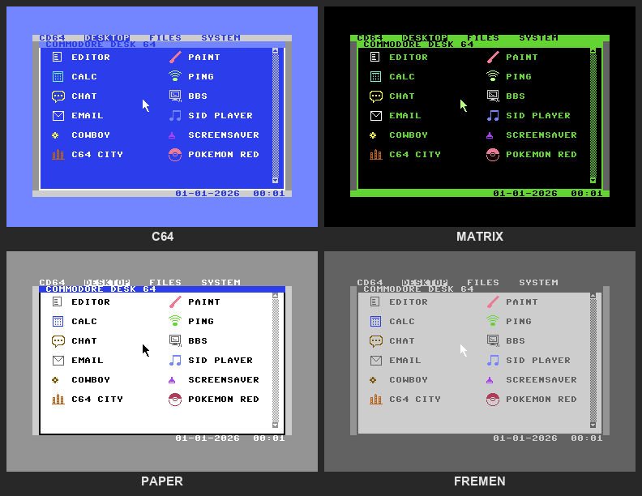

| Theme | Look |
|---|---|
| **C64** | the classic blue C64 screen with grey bars |
| **MATRIX** | green on black |
| **PAPER** | black on white |
| **FREMEN** | shades of grey: dark grey on light grey |
| **STONE** | a classic 8-bit desktop look (see below) |
| **DESK64** | the default: the STONE layout in the colours of the boot screen — blue windows with white text and lines, yellow accents, a light grey dotted desktop; with the TINY font |

### The STONE and DESK64 themes

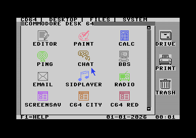

SETTINGS → THEME → STONE changes more than the colours; any other theme
brings the normal look back at once. **DESK64**, the default theme on a new
disk, has the same layout in blue (on an existing disk your own `CD64.CFG`
keeps your theme; pick DESK64 under SETTINGS → THEME, and TINY under FONT).

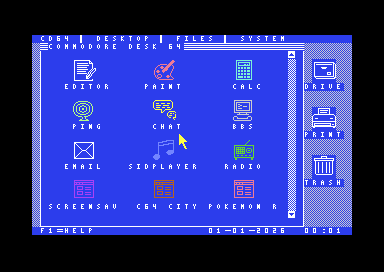

- Light grey with black text; the menu bar and status bar have no coloured
  bar, window titles are striped, buttons dotted and the desktop edge is
  checkered. The menus are separated by thin lines.
- The desktop shows large 24×24 icons in three columns with the name
  underneath (own drawings, in the file `STONEICON`).
- To the right of the window: **DRIVE** (opens FILES), **PRINT** (no printer
  support yet, it says so) and **TRASH**. These three icons are there in
  every theme (in the other themes as small icons in their style). Each can
  be switched off under SETTINGS (DRIVE / PRINT / TRASH, saved in
  `CD64.CFG`); with all three off the desktop window uses the full width
  again and nothing is dragged.
- **Drag** an icon with the mouse button held: the pointer becomes the icon.
  Drop it on TRASH to throw one of your own programs away (built-in
  programs stay). TRASH shows what is in it: **RESTORE** puts a program
  back on the desktop, **EMPTY** removes them for good (it asks first). The
  trash is kept in `DESK.APPS`.
- A drop on the same icon starts it, a drop on DRIVE or PRINT is a click
  there.

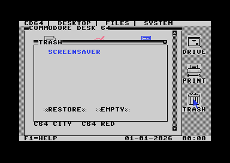

Ten fonts. Five are built in: SYSTEM, CLASSIC (italic), BOLD, LOWER (lower
case) and TINY. Five are loaded from disk: FREMEN, SERIF, MONO, CASUAL and
HEAVY. The whole screen switches at once, including the menu bar, window
titles and status bar.

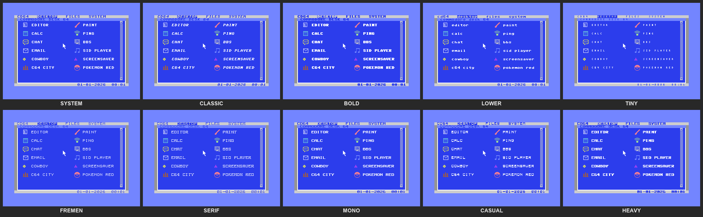

Only the 16 VIC-II colours are used:

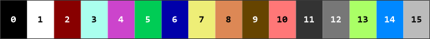

---

## Controls

| Action | Mouse (port 1) | Joystick (port 2) | Keyboard |
|---|---|---|---|
| Move the pointer | move | push | cursor keys (+ SHIFT for left/up) |
| Click | left button | fire | SPACE or RETURN |
| Help | | | F1 |
| Close the program | click ✕ | | ESC (= RUN/STOP) |

In VICE on a PC, RUN/STOP is the **Esc** key.

In the BBS terminal and the e-mail editor the keyboard works like on a real
C64. The cursor keys move the text cursor there, not the pointer.

---

## Your files and settings

| File | What it holds |
|---|---|
| `CD64.CFG` | theme, colours, mouse pointer colour, font, menu style, sound, time zone, the DRIVE/PRINT/TRASH icons, printer |
| `NET.CFG` | network and chat server settings |
| `MAIL.CFG` | e-mail settings, **including your password** |
| `BBS.CFG` | default BBS, local echo |
| `BBS.BOOK` | your own BBSes |
| `DESK.APPS` | your own programs on the desktop |

`build_disk.bat` formats fresh disk images on every build. So that you never
lose your settings, it first copies these files from the old disk image you
used last (D81, D71 or D64) to `..\userfiles` (next to the repository, never
committed) and then puts them back on the new disks.

The folder layout:
```
commodore_desk\
  development\   this repository (source, tools, build\)
  userfiles\     your settings from the disks (never committed)
  parked\        the real games C64 CITY and C64 RED (third party)
```

---

## Building

Requirements (paths are set in the `.bat` scripts): **Java**, **Kick
Assembler** (`KickAss.jar`), **VICE** (`x64sc`, `c1541`, `cartconv`) and
**Python 3**.

**One-time: the character set.** The C64 character ROM is not in this
repository (copyright). Extract it from your VICE installation:
```bash
mkdir -p data
head -c 2048 "<VICE>/C64/chargen-901225-01.bin" > data/chargen.bin
```
Then generate the extra fonts (adjust the ROM path at the top of the script):
```bash
python tools/make_fonts.py
python tools/make_fremenfont.py
```

**Disks (D81, D71 and D64):**
```bat
build_disk.bat
```
This builds the core, the program overlays (FILES, EDITOR, PAINT, CALC, SETUP,
DESKTOOL, SIDPLAY, INET, BBS, EMAIL, TIME, RADIO) and the fonts, and writes everything to
`build\CD64.d81`, `build\CD64.d71` and `build\CD64.d64`.

The real games (`c64cdesk.prg` = C64 CITY, `c64rdesk.prg` = C64 RED) go
into `..\parked`, SID music files into `sid\`. Third-party programs and music
are not part of this repository; without them the disks get small
placeholders for the games.

- **D81** (1581, 800 KB): **everything**, including the real games, the SID
  files and your settings, with about 2300 blocks to spare. This is the main
  disk.
- **D71** (1571, double-sided): the system with placeholder games. At start-up CD64 switches
  the 1571 to double-sided mode (`U0>M1`), because a 1571 on a C64 starts
  as a 1541 and cannot read the second side.
- **D64** (1541): the system and all programs always go on it. The extras
  (games, SID files) are added by `tools/disk_add.py` only while they fit,
  keeping 10 blocks free for your settings. What does not fit is reported.

**Cartridge (EasyFlash .CRT):**
```bat
build_cart.bat
```
```bash
x64sc -cartcrt build/CommodoreDesk64.crt -8 build/CD64.d71
```
The cartridge boots instantly and loads the programs from the disk in drive 8.
To use it on real hardware, copy the `.CRT` to an SD card and flash it with
**EasyProg**.

---

## Running it in VICE with networking

VICE emulates the **RR-Net** cartridge and connects it to a network adapter
on your PC through **Npcap**.

1. **Install Npcap** from <https://npcap.com> as administrator and tick
   **"Install Npcap in WinPcap API-compatible Mode"**. VICE needs `wpcap.dll`.
2. **Double-click `start_cd64.bat`** (the D81 if it is there, otherwise the
   D71; or name one: `start_cd64.bat build\CD64.d64`). For a D81 drive 8
   becomes a 1581.
   It starts WSL, looks up the `vEthernet (WSL)` adapter, writes the matching
   IP, mask and gateway into `NET.CFG` on the disk (the other settings stay)
   and starts VICE with the RR-Net on that adapter.

> **Why WSL and not Wi-Fi?** Wi-Fi adapters drop frames from a "foreign"
> network card (the C64's own MAC address), so even your router won't answer.
> On the Hyper-V `vEthernet (WSL)` adapter, Windows itself is the gateway and
> routes on to your network, the internet and Tailscale. That adapter only
> exists while WSL runs, and it gets a new ID each time WSL starts, which is why
> `start_cd64.bat` looks it up every time.

Manual start (with a wired adapter, for example):
```bash
x64sc -drive8type 1571 +georam -reu -reusize 512 -ethernetcart -ethernetcartmode 1 -ethernetcartbase 0xDE00 -ethernetioif "\Device\NPF_{GUID}" -autostart build/CD64.d71
```
List the adapter GUIDs with PowerShell:
`Get-NetAdapter | Select-Object Name, InterfaceGuid`.
GeoRAM must be off (it also uses `$DE00`); the REU (`$DF00`) is fine and
becomes RAM drive `R:30` in the File Manager. Drive 8 must be a 1581 for the D81,
a 1571 for the D71, or a 1541 for the D64.

**Check:** SYSTEM → NETWORK should show `PLATFORM: RR-NET` and
`STATUS: READY`.

**Testing e-mail without a real mailbox:** `tools/mailtest_server.py` is a
small POP3/SMTP server with a test mailbox (user `test@c64.test`, password
`Secret99`). Run it inside WSL so VICE can reach it:
```bash
wsl python3 tools/mailtest_server.py 1110 1587
```

---

## Real hardware

- **RR-Net** (or a compatible CS8900a cartridge at `$DE00`): works like in
  VICE. Set the IP address in SYSTEM → NETWORK, or use DHCP.
- **Ultimate 64 / 1541 Ultimate-II+**: enable the **Command Interface**. The
  Ultimate's own network connection is used, and its firmware handles TCP/IP
  and DNS. VICE cannot emulate this, so it can only be tested on the real thing.
- **WiC64** (WiFi module on the userport, firmware 2.x): set up the WiFi
  connection with the WiC64's own tools first. CD64 then finds it by itself;
  BBS, EMAIL, CHAT and TIME work through it (its firmware does TCP and DNS).
  PING and DHCP are not available on it. In VICE 3.8+ it can be emulated:
  `x64sc -userportdevice 23`.
- **Cartridge build**: EasyFlash uses `$DE00`/`$DF00` itself, so the RR-Net
  cannot be used together with it. The WiC64 works, because it is on the
  userport.

---

## Architecture

```
gui/      shell (menu bar, windows, status bar) · desktop launcher · widgets · help
gfx/      drawing primitives · fonts and icons · mouse pointer sprite
kernel/   start-up · events · raster IRQ (50 Hz) · clock · memory
hal/      VIC · input (mouse, joystick, keyboard) · disk (IEC) · sound (SID) · WiC64 (userport)
apps/     files (+ RAM drives) · editor · paint · calc · settings · network/ping/chat · SID player
apps/bbs/ BBS client: directory, session, terminal, Telnet
apps/email/  e-mail: settings, POP3, SMTP, MIME/text decoding, screens
apps/time/   date and time: NTP client, time zones, summer time
apps/radio/  SID Radio: playlist, HTTP download, plays with the SID player
net/      network stack: CS8900, Ultimate UCI, WiC64, ARP/IP/ICMP, TCP, UDP, DNS, DHCP
include/  palette · layout · memory map · ABI · hardware
```

- **The core** (kernel, graphics, input, shell, desktop) lives at `$0801` and
  always stays in memory.
- **Every program is an overlay**: a separate PRG loaded from disk into
  `$8000–$BFFF` when you open it. BBS and EMAIL are separate assemblies that
  include their own copy of the network stack; they call the core through
  addresses exported by `tools/export_core_syms.py`.
- **Display**: 40×25 character mode with its own charset at `$3800`. The
  icons are drawn with that charset, and the pointer is hardware sprite 0.
  Paint switches to a multicolour bitmap in VIC bank 1.
- **Memory**: BASIC and KERNAL are banked out. The KERNAL is switched in only
  for disk access. Network and e-mail buffers use the RAM under the I/O area
  and the KERNAL.

---

## Files and tools

| File | Purpose |
|---|---|
| `disk_main.asm` | the core for the disk version |
| `main_cart.asm` | the EasyFlash cartridge version |
| `boot_main.asm` | boot loader with the splash screen |
| `bbs_main.asm`, `email_main.asm`, `time_main.asm`, `radio_main.asm` | the BBS, EMAIL, TIME and RADIO overlays |
| `build_disk.bat`, `build_cart.bat` | build scripts |
| `start_cd64.bat`, `tools/start_cd64.ps1` | start VICE with working networking |
| `tools/export_core_syms.py` | core addresses for the separately built overlays |
| `tools/mailtest_server.py` | POP3/SMTP test server |
| `tools/disk_add.py` | writes optional files to a disk image only when they fit |
| `tools/make_fonts.py`, `tools/make_fremenfont.py` | font generators |
| `tools/make_bootscreen.py` | boot screen bitmap |
| `docs/` | development plans (Dutch) and screenshots |
